This is a fork of Hashlip's art engine with several additional features and quality of life changes

🛠️🛠️ More features being added 🛠️🛠️

<br/>
If you have any questions, please feel free to ask me in the various channels I can be reached (Discord will be the most consistent)
<br/>
<br/>


## Relevant links / socials,

[datboi](https://linktr.ee/datboi1337)

<br/>
<br/>

# Installation notes
Use Node 18-20

# Enhanced Features in this fork

## More efficient generation
- [Split metadata and image generation](#split-metadata-and-image-generation)

## Set incompatible layers
- [Guided wizard for setting incompatible traits](#incompatibility-wizard)
  - [Incompatibility wizard example](#incompatibility-wizard-example)
  - [Bulk incompatibility entry (bulk)](#advanced-incompatibility)

## Additional network selections
- [Metadata standard output for Ethereum, Solana, and SEI](#network-selection)

## Named rarity weight
- [Use named weights instead of numbers in filename](#use-named-weight-instead-of-filename)
  - [Named weight example](#named-weight-example)

## Exact rarity weight

- [Set trait weight to equal the exact number of times you want that trait in the collection rather than using rng](#use-exact-weight-instead-of-rng)
  - [Exact weight example](#exact-weight-example)

## Layer Variation
- [Assign layer variations to ensure layers with that variation match eachother](#layer-variation-system)
  - [layer variation example](#layer-variation-example)

## Add stat blocks
- [Assign randomized stats within defined range to each NFT!](#stat-blocks)
  - [Stat blocks examples](#stat-block-examples)

## Add extra attributes
- [Add extra attributes to every NFT](#extra-attributes)
  - [Extra attributes example](#extra-attributes-example)

## Resume creation
- [Generate NFT in stages](#generate-nft-in-stages)
  - [resumeNum example](#resumenum-example)

## Allow duplicate images/metadata
- [Allow duplicate images to be duplicated](#allow-duplicates)

## Define DPI in format
- [Define DPI in addition to resolution](#define-dpi)

## Individual name and description per layer configuration
- [Assign unique name and description per layer configuration](#unique-name-and-description)

## Set layer configurations to desired size
- [set growEditionSizeTo per layer configuration, instead of cumulatively](#non-cumulative-growEditionSizeTo)
  - [growEditionSizeTo example](#growEditionSizeTo-example)

## Utils
- [cleanMetadata](#cleanmetadata)
- [removeAttributes](#removeattributes)
- [renameAttributes](#renameattributes)
- [generateOldDna](#generateolddna)
- [recreateAndSortMetadata](#recreateandsortmetadata)
- [rarityFromMetadata](#rarityfrommetadata)

### Planned upcoming features coming soon

- GIF generation 👀
- Image/Metadata IPFS upload
- Adding bulk entry to incompatibility wizard
- Adding terminal interaction for most metadata manipulation utilities to avoid direct script editing
- Cleanup terminal output for rarity during generation

# General use
0) (first time) run `npm install`
1) Import layer files
2) Define collectionSize in config.js
3) Define network in config.js
4) Define general metadata (and solanaMetadata of generating for Solana)
5) Update layerConfigurations in config.js. Be sure to define them in the order they are to be selected. First definition is the 'bottom' or 'back' of the image. 
6) Run generation with `npm run generate`
7) Follow prompts to define any incompatibilities
8) Review metadata once it's been generated, and follow the prompts to generate images if metadata is generated to your specification. 

# Split metadata and image generation
All metadata will be generated immediately upon running `npm run generate`. This allows generation to happen much faster, and provides a trait breakdown in the terminal upon completion, with a prompt to continue to photo generation. Any issues with metadata/compatibility can be seen and rectified much faster, then when all is well, image generation can take place. 
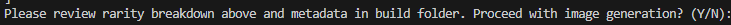

# Incompatibility Wizard
You will be prompted in the terminal for any incompatibilities in your collection when running generation. Incompatible traits must be defined by first selecting the item that will be selected first in the layersOrder, then choosing a trait that will be selected after the first. The incompatibility wizard will only allow you to select options that appear *after* the first trait. 

# Incompatibility wizard example
With the default layers in this fork, we can define the following incompatibility (arbitraily chosen for demonstration): Eyes/EyeScar is not compatible with Back/StrapOnShark. We can tell the engine not to generate those items together like so:
<br/>

1) When running `npm run generate`, you will be prompted whether you want to input any incompatible layers. 
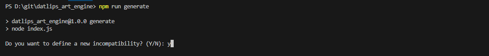
2) Select layer configuration index (if applicable)
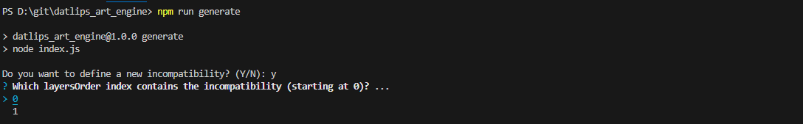
3) Select the layer your *first* trait is located in
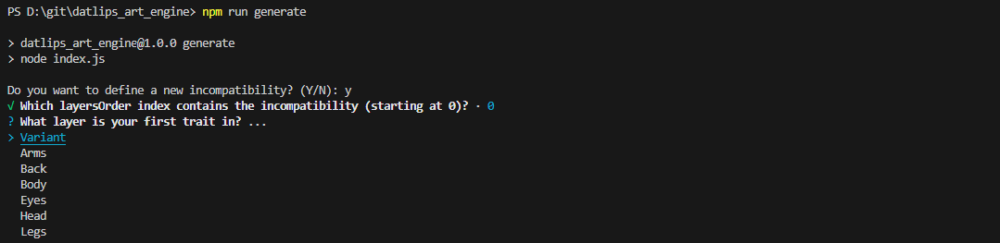
4) Select the first trait
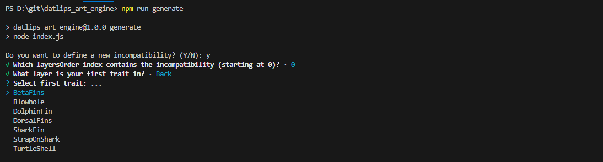
5) Select the layer your *second* trait is located in
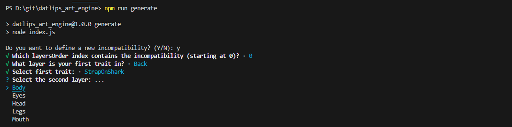
6) Select the second trait
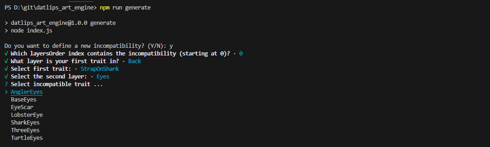
7) Allow engine to calculate new compatibile paths. **NOTE** Depending on your trait count, this may take some time. 
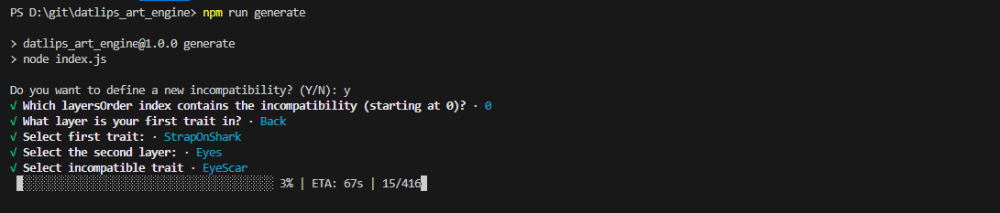
8) You will be prompted again to enter any more incompatibilities you may have
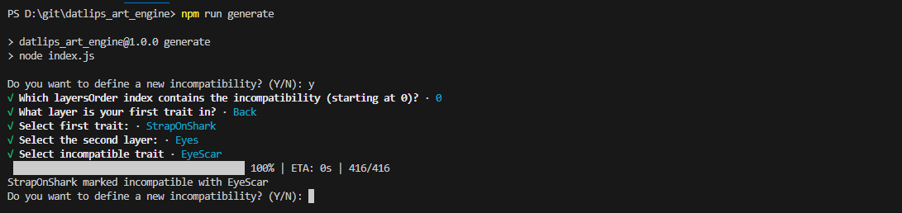

<br/>
In cases where generation needs to be run again, or incompatibilities have been defined manually (see Advanced incompatibility below), you will be prompted to review existing incompatibilities and asked to either proceed with generation, add more incompatibilities, or remove all incompatibilities to start fresh (you will be prompted to add incompatibilities again, if needed).

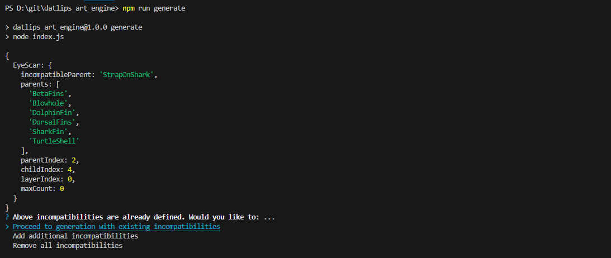

# Advanced incompatibility
If you need to define multiple incompatibilities, and you don't want to use the wizard, you *can* define them manually by editing compatibility/compatibility.json, adding an object like the example below. 
**NOTE** This should really only be used by advanced users. If this is defined incorrectly, it's possible for some of your incompatibilities to not work properly!
```js
{
  "EyeScar": {
    "incompatibleParent": "StrapOnShark",
    "parents": [
      "BetaFins",
      "Blowhole",
      "DolphinFin",
      "DorsalFins",
      "SharkFin",
      "TurtleShell"
    ],
    "parentIndex": 2,
    "childIndex": 4,
    "layerIndex": 0,
    "maxCount": 0
  }
}
```

# Network selection
This fork will generate metadata for Ethereum, Solana, and SEI. Most EVM chains follow Ethereum metadata standards. Please be sure to define all General metadata in config.js, as well as `solanaMetadata` if generating for Solana. 

# Use named weights instead of numbers in filename
This fork gives the option to use a simpler weight system by using common rarity names (Common, Uncommon, Rare, Epic, Legenedary, and Mythic) instead of numbers. Weight will be calculated based on named value. Please reference `rarity_config` in config.js for more detail. The values in `rarity_config` can be edited, if needed. 

## Named weight example
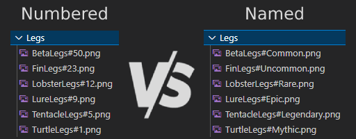

```js
const rarity_config = {
  Mythic: 1,
  Legendary: 6,
  Epic: 15,
  Rare: 31,
  Uncommon: 56,
  Common: 100,
};
```
You can view `rarity_config` in config.js to understand the differences between rarities. Something marked 'Common' will appear 100x more than something marked 'Legendary'. **NOTE**: Even with such a difference between two traits, all traits will be generated at least once. 

# Use exact weight instead of rng
This fork gives the option to use define exact counts of traits rather than using weight to randomly determine counts of traits. 

## Exact weight example
To use exact weight system, set `exactWeight` to true in config.js. When this option is enabled, the weight of any given trait is set to will be the exact number of times that trait appears in the collection. ie: `trait#50.png` will appear exactly 50 times throughout the collection. <br/>

**PLEASE NOTE**: All weights in a given folder must add up to the layersOrder edition size! Traits with the same names across multiple layersOrders will be counted separately!

```js
const exactWeight = true;
```

# Layer variation system
Use this option to assign a 'variation' to multiple layers. The most common use-case for this option would be ensuring certain traits are the same color or skin pattern. To use the layer variation system, define a layer called 'Variant' in your layer configuration. Populate the 'Variant' folder with blank png, named and weighted according to your variants. Next, create folders in each trait folder where you want the variation applied, and name them after relevent variants. The engine will select a variant, then any trait chosen will adhere to that variant if possible. 
**NOTE** 'Variant' is a restricted layer name. If your collection needs a layer called 'Variant', please be sure to name the folder something else and use the `displayName` option to name your layer appropriately. <br/>
**NOTE** If using the variant system, 'Variant' *must* be the first defined layer. <br/>
**NOTE** If a chosen trait does not have a matching variant, it's default trait file will be rendered in the final image. 

## Layer variation example
In this fork, there are currently two layers with variations (Arms and Head). If you look at the file structure, you will see a Variant folder containing Blue, Green, Purple, and Red blank pngs, and both the Arms and Head folders have nested Blue, Green, Purple, and Red folders containing all traits with compatible variant versions. <br/>
- Base 'Variant' folder:
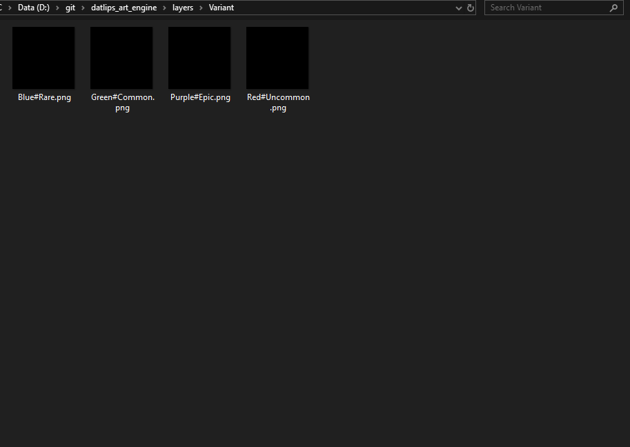
- Arms Trait folder contents:
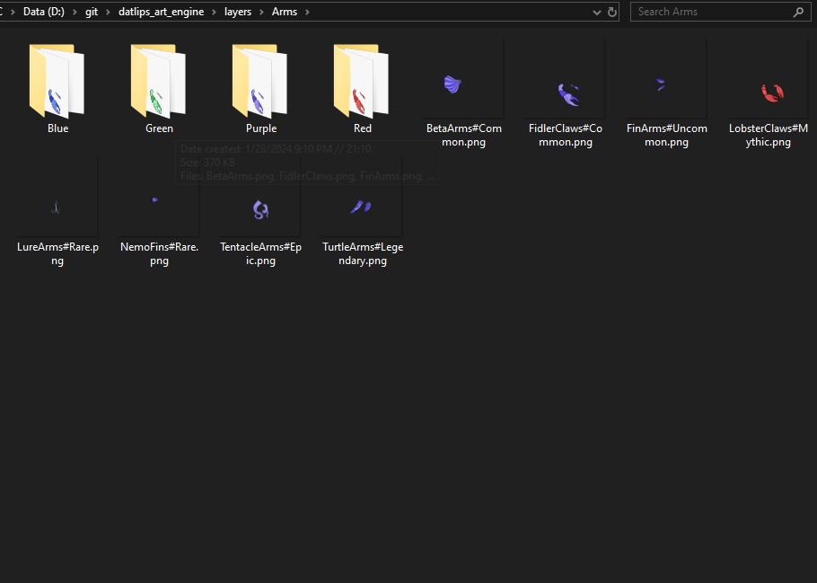
- Arms Trait variant (blue) folder contents:
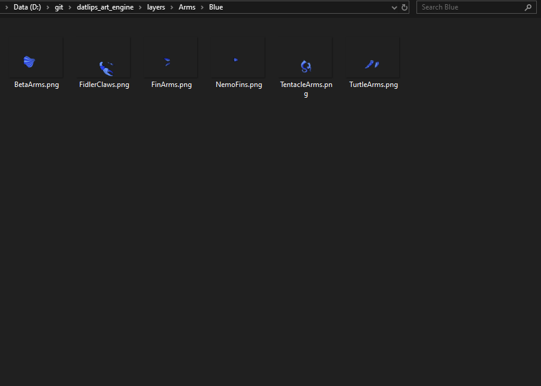
- Arms Trait variant (green) folder contents:
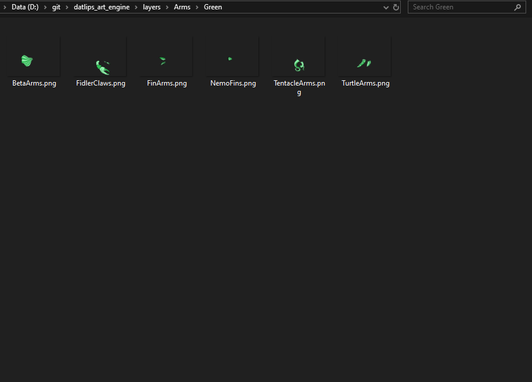
<br/>

For this setup, the layer configuration should look like this. **Please note** that the 'Variant' folder is defined as the first layer, and that it's using the `displayName` option to use the name 'Color' in the final metadata. 

```js
  {
    growEditionSizeTo: collectionSize/2,
    namePrefix: collectionName,
    description: description,
    layersOrder: [
      { name: "Variant", options: { displayName: "Color" } },
      { name: "Arms" },
      { name: "Back" },
      { name: "Body" },
      { name: "Eyes" },
      { name: "Head" },
      { name: "Legs" },
      { name: "Mouth" },
    ],
  },
```

# Stat blocks
Add any number of stats to your tokens! All examples are from the [Opensea Metadata Standards](https://docs.opensea.io/docs/metadata-standards). Please visit to see how each display_type will look on Opensea.  

## Stat block examples
To use stat blocks, simply set `enableStats` to 'TRUE' in config.js. 
```js
const enableStats = true;
```
You can randomize the value in each new attribute in `const statBlocks`. You can control the range of the `value` by defining `minValue` & `maxValue`. <br/>
**NOTE**: Leave `value` set to '0' here. If you change it, the generated value may fall outside the range set by `minValue` & `maxValue`.
```js
{
  minValue: 1,
  maxValue: 999,
  attribute:
  {
    display_type: "number", 
    trait_type: "Stamina", 
    value: 0
  },
},
```
The generated trait in the example above will add a trait like this to the metadata:
```js
{
  "display_type": "number",
  "trait_type": "Stamina",
  "value": 84
},
```

# Extra attributes
Allows adding extra *attributes* to the metadata. `extraMetadata` is restricted to only adding things outside the attribute. This functionality allows adding extra information to the attributes so they can be displayed in marketplaces. <br/>

**NOTE**: This will add the *same* information to each NFT's metadata. 

## Extra attributes example
This works similarly to the already present `extraMetadata`, but you can add multiple items. Anything added to this section will be added to every NFT's metadata. 
```js
const extraAttributes = [
  {
    trait_type: "New Trait",
    value: "Extra",
  }
];
```

# Generate NFT in stages
This fork gives the ability to start generation at any number. This can sometimes be useful, but in 99% of cases generation should be done all at once. These options simply provide tools for the other 1%. Utilizing a previous generations dna will help to prevent duplicates from being generated. Please be sure to utilize the oldDna [Util](#generateolddna).

## resumeNum Example
`resumeNum` can be set independantly to simply start edition at a higher number, but if you want to use old dna, your `resumeNum` must be set and it must equal the number of items in _oldDna.json

```js
const resumeNum = 0;
const importOldDna = false;
```

# Allow duplicates 
If you want duplicates in your collection, you can set the allowDuplicates flag to true. 
```js
const allowDuplicates = true;
```

# Define DPI 
If you need to adjust your DPI, that has been added as an option in config.js under `format`. 
```js
const format = {
  width: 512,
  height: 512,
  dpi: 72,
  smoothing: false,
};
```

# Unique name and description
`namePrefix` and `description` have been moved to be contained within `layerConfigurations`. This allows separate names and descriptions based on the specific traits being selected.  

# Non cumulative growEditionSizeTo
`growEditionSizeTo` is no longer cumulatively defined. You can now set this number to simply represent the number of images you want generated within that layer configuration. <br/>
**NOTE**: `collectionSize` must be defined, and match the total of your `growEditionSizeTo`s. 

## growEditionSizeTo example
The default setup in config.js demonstrates this system:
```js
const layerConfigurations = [
  {
    // NOTE!! growEditionSizeTo should be set to the number of images you want generate within each layer configuration
    growEditionSizeTo: 50, // << This will generate 50 images with this layersOrder
    namePrefix: collectionName,
    description: description,
    layersOrder: [
      { name: "Variant", options: { displayName: "Color" } },
      { name: "Arms" },
      { name: "Back" },
      { name: "Body" },
      { name: "Eyes" },
      { name: "Head" },
      { name: "Legs" },
      { name: "Mouth" },
    ],
  },
  {
    growEditionSizeTo: 15, // This will generate 15 images with this layersOrder
    namePrefix: 'Alternate Name',
    description: 'Alternate Description for this set of tokens',
    layersOrder: [
      { name: "Arms" },
      { name: "Back" },
      { name: "Body" },
      { name: "Head" },
      { name: "Mouth" },
    ],
  },
];
```
# Utils

## cleanMetadata
This utility gives the option to remove some commonly requested items. Set any to true to remove them from generated metadata. Original metadata is preserved, and clean metadata is saved to build_new/json <br/>

**NOTE**: These elements are used as keys in other utilities, so please be sure to backup your metadata before running this, and only run AFTER running any other metadata manipulation utility (rename, update URI, etc.).

```js
let removeDna = true;
let removeEdition = false;
let removeDate = true;
let removeCompiler = false;
```

## removeAttributes
This utility gives the ability to remove any attributes either by trait_type or value. Commonly used to remove 'None', but can be set to remove any attribute. Add each item you'd like removed from the attributes to the `removeValue` and/or `removeTraitType` arrays:

```js
let removeValue = [ "None", "Test" ] //Enter values you want to remove here. (ie: "None")
let removeTraitType = [ "Head" ] //Enter a Traits you want to remove here. (ie: "Head")
```


## renameAttributes
This utility gives the ability to rename any attributes either by trait_type or value. Simply enter the values and/or trait types that you want to replace into `valueBefore` and/or `traitTypeBefore`, and what you want them replaced with in `valueAfter` and/or `traitTypeAfter`.<br/>
**NOTE**: Arrays must be the same length and be in the correct order for replacement to work properly. In the example, "FishHead" will be replaced with "StandardHead", "Purple" will be replaced with "Lavender", etc.

```js
let valueBefore = [ "FishHead", "Purple" ] //Enter old values here
let valueAfter = [ "StandardHead", "Lavender" ] //Enter new values here
let traitTypeBefore = [ "test", "Color" ] //Enter old trait_types here
let traitTypeAfter = [ "Hat", "Skin" ] //Enter new trait_trypes here
```

## generateOldDna
This utility generates a dnaList for import from a previous generation's metadata. As mentioned several times, the better options is typically to regenerate everything; however, this gives the ability to prevent duplicates from being generated based on old information. 

You must place your previously generated _metadata.json file in the build_old folder. 

## recreateAndSortMetadata
This utility recreates all individual metadata files as well as _metadata.json and orders them numerically. This can be useful if _metadata.json was accidentally deleted from the build folder or if you need each item in _metadata.json to be ordered numerically.

No edits necessary to use this util. 

## rarityFromMetadata
This utility counts all traits and calculates their occurence percentages, calculates scores based on each NFT's traits, ranks each NFT by their score, and determines their named rarity (Common, Uncommon, Rare, Epic, Legendary, Mythic). It also enables the ability to add any or all of this information to the metadata itself as it's own element or as an attribute! 

**NOTE**: This utility replaces the old 'rarity.js' script. 'yarn rarity' will now call this utility.
<br/>

**NOTE**: Due to a change in how traits are determined, this will no longer display any 0 qty traits. Be sure to review 'rarityBreakdown' in the rarity folder. 
<br/>

**NOTE**: Any attribute with display_type will not include occurance percentage in the value, even if `includeTraitPercentages` is set to true to avoid issues with displaying properly on marketplaces. 
By default, Rank will be added as an attribute and Rarity will be added as an element to the metadata when running this utility. You can adjust what will be added to the metadata by editing these items: 

```js
const scoreAttribute = false;
const scoreElement = false;

const rankAttribute = false;
const rankElement = true;

const rarityAttribute = true;
const rarityElement = false; 

const includeTraitPercentages = false;
```
scoreAttribute will add a trait to the metadata like:
```js
{
  "trait_type": "rarityScore",
  "value": 173
}
```
rankAttribute will add a trait to the metadata like:
```js
{
  "trait_type": "Rank",
  "value": 29
}
```
rarityAttribute will add a trait to the metadata like:
```js
{
  "trait_type": "Rarity",
  "value": "Rare"
}
```
includeTraitPercentages will add occurence percentages to all other traits like:
```js
{
  "trait_type": "Color",
  "value": "Red (12.00%)"
}
```
